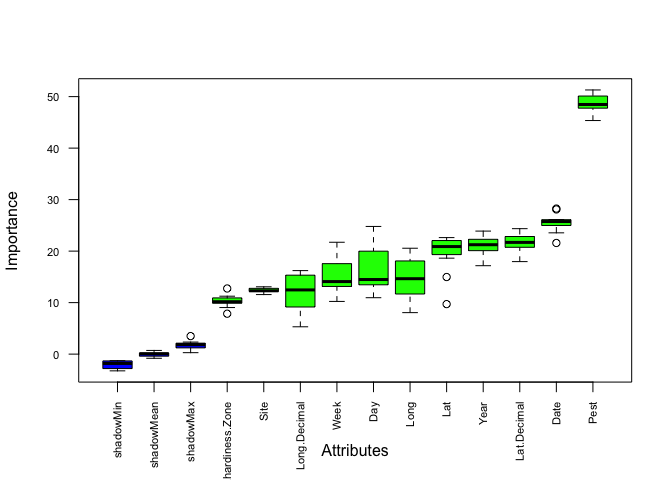
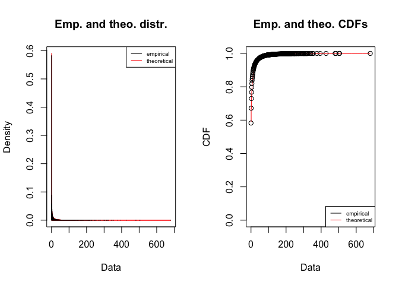
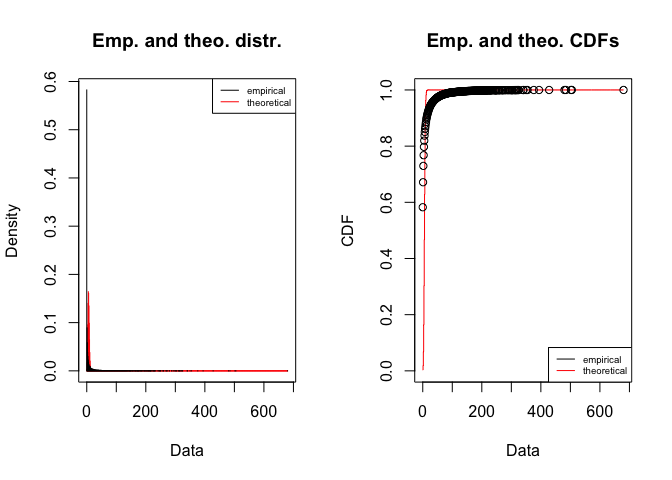

NYSIPM_Sweet_Corn_Modeling
================
Chloe Cho
2023-02-08

# Questions

- Splitting the pest models? Can use the economic threshold to create a
  binary outcome.

# Data

## NYS IPM Data

### Read & Clean Data

Data from NYS IPM (Marion Zuefle) for ECB_E, ECB_Z, CEW, FAW, and WBC.

``` r
sweet_corn_pest <- read.delim("NYSIPM_Sweet_Corn_1993_2022.csv", sep = ",")

sweet_corn_pest <- sweet_corn_pest %>% 
  mutate(Date = as.Date(Date, format = '%m/%d/%y')) %>%
  mutate(Site = as.factor(Site)) %>%
  mutate(USDA.hardiness.Zone = as.factor(USDA.hardiness.Zone)) %>%
  mutate(new_col = format(Date, "%j"), .after = Date) %>%
  rename(Day = new_col) %>%
  mutate(Day = as.numeric(Day)) 

sweet_corn_pest_long <- melt(sweet_corn_pest, id.vars = c("Site", "USDA.hardiness.Zone", "Lat", "Long", "Year", "Week", "Date", "Day"), measure.vars = c("ECB.E", "ECB.Z", "CEW", "FAW", "WBC"), variable.name = 'Pest', value.name = 'Count')

head(sweet_corn_pest_long)
```

    ##     Site USDA.hardiness.Zone            Lat           Long Year Week       Date
    ## 1 Accord                  6a  41°46'56.41"N  74°14'44.28"W 2021   21 2021-05-25
    ## 2 Accord                  6a  41°46'56.41"N  74°14'44.28"W 2021   22 2021-06-01
    ## 3 Accord                  6a  41°46'56.41"N  74°14'44.28"W 2021   23 2021-06-08
    ## 4 Accord                  6a  41°46'56.41"N  74°14'44.28"W 2021   24 2021-06-15
    ## 5 Accord                  6a  41°46'56.41"N  74°14'44.28"W 2021   25 2021-06-22
    ## 6 Accord                  6a  41°46'56.41"N  74°14'44.28"W 2021   26 2021-06-29
    ##   Day  Pest Count
    ## 1 145 ECB.E    NA
    ## 2 152 ECB.E    NA
    ## 3 159 ECB.E    NA
    ## 4 166 ECB.E    NA
    ## 5 173 ECB.E     0
    ## 6 180 ECB.E     0

### NYS Sites

``` r
sites <- read.delim("NYSIPM_Sweet_Corn_1993_2022_Sites.csv", sep = ",")

length(levels(sites$Site))
```

    ## [1] 0

``` r
sites <- sites %>% 
  mutate(Site = as.factor(Site)) 

sites <- sites %>%
  dplyr::select(-c('X', 'X.1', 'X.2', 'X.3', 'X.4', 'X.5', 'X.6', 'X.7'))

head(sites)
```

    ##           Site USDA.hardiness.Zone            Lat Lat.Decimal           Long
    ## 1       Accord                  6a  41°46'56.41"N    41.78234  74°14'44.28"W
    ## 2      Accord                   6a  41°46'56.41"N    41.78234  74°14'44.28"W
    ## 3 Adams Center                  4b  43°51'52.56"N    43.86460  75°57'53.64"W
    ## 4        Afton                  5b  42°13'57.32"N    42.23259   75°31'3.54"W
    ## 5       Albion                  6a                         NA               
    ## 6    Amsterdam                  5a  43° 1'18.48"N    43.02180  74°10'48.72"W
    ##   Long.Decimal
    ## 1    -74.24563
    ## 2    -74.24563
    ## 3    -75.96490
    ## 4    -75.51765
    ## 5           NA
    ## 6    -74.18020

Add decimal GPS coordinates to table.

``` r
sites_decimal_gps <- sites %>%
  dplyr::select(c('Site', 'Lat.Decimal', 'Long.Decimal'))

sweet_corn_pest_full <- sweet_corn_pest_long %>%
  left_join(sites_decimal_gps, by = c("Site" = "Site"))

head(sweet_corn_pest_full)
```

    ##     Site USDA.hardiness.Zone            Lat           Long Year Week       Date
    ## 1 Accord                  6a  41°46'56.41"N  74°14'44.28"W 2021   21 2021-05-25
    ## 2 Accord                  6a  41°46'56.41"N  74°14'44.28"W 2021   22 2021-06-01
    ## 3 Accord                  6a  41°46'56.41"N  74°14'44.28"W 2021   23 2021-06-08
    ## 4 Accord                  6a  41°46'56.41"N  74°14'44.28"W 2021   24 2021-06-15
    ## 5 Accord                  6a  41°46'56.41"N  74°14'44.28"W 2021   25 2021-06-22
    ## 6 Accord                  6a  41°46'56.41"N  74°14'44.28"W 2021   26 2021-06-29
    ##   Day  Pest Count Lat.Decimal Long.Decimal
    ## 1 145 ECB.E    NA    41.78234    -74.24563
    ## 2 152 ECB.E    NA    41.78234    -74.24563
    ## 3 159 ECB.E    NA    41.78234    -74.24563
    ## 4 166 ECB.E    NA    41.78234    -74.24563
    ## 5 173 ECB.E     0    41.78234    -74.24563
    ## 6 180 ECB.E     0    41.78234    -74.24563

## Feature Selection

Testing a few different kinds of feature selection with current
variables. Will add more as we get climate and soil data.

Boruta feature selection. Read about Boruta
[here](https://towardsdatascience.com/boruta-explained-the-way-i-wish-someone-explained-it-to-me-4489d70e154a).

``` r
sweet_corn_pest_features <- sweet_corn_pest_full %>%
  na.omit(subset(sweet_corn_pest_full, select = c('Site', 'Lat.Decimal', 'Long.Decimal', 'Year', 'Week', 'Date', 'Day', 'Pest', 'Count')))

set.seed(42)
boruta <- Boruta(Count ~ ., data = na.exclude(sweet_corn_pest_features), doTrace = 2, maxRuns = 500)
```

    ##  1. run of importance source...

    ##  2. run of importance source...

    ##  3. run of importance source...

    ##  4. run of importance source...

    ##  5. run of importance source...

    ##  6. run of importance source...

    ##  7. run of importance source...

    ##  8. run of importance source...

    ##  9. run of importance source...

    ##  10. run of importance source...

    ##  11. run of importance source...

    ## After 11 iterations, +56 secs:

    ##  confirmed 11 attributes: Date, Day, Lat, Lat.Decimal, Long and 6 more;

    ##  no more attributes left.

``` r
print(boruta)
```

    ## Boruta performed 11 iterations in 56.00556 secs.
    ##  11 attributes confirmed important: Date, Day, Lat, Lat.Decimal, Long
    ## and 6 more;
    ##  No attributes deemed unimportant.

``` r
plot(boruta, las = 2, cex.axis = 0.7)
```

<!-- -->

Run a random forest to select which features are most important.

``` r
rf <- randomForest(Count ~ Lat.Decimal + Long.Decimal + Year + Week + Date + Day + Pest, data = sweet_corn_pest_features, ntree = 500)
importance(rf)
```

    ##              IncNodePurity
    ## Lat.Decimal      1840817.5
    ## Long.Decimal     1678849.3
    ## Year             1305462.8
    ## Week              983447.9
    ## Date             2042099.6
    ## Day              1724627.4
    ## Pest             2165924.2

## GLMM

### Selecting a Distribution

Negative binomial.

``` r
plot(fitdist(c(na.exclude(sweet_corn_pest_full$Count)),"nbinom"))
```

<!-- -->

Poisson.

``` r
plot(fitdist(c(na.exclude(sweet_corn_pest_full$Count)),"pois"))
```

<!-- -->

By comparing these two graphs, the negative binomial distribution fits
the count data better than a Poisson distribution. This will be the
distribution used in future models.

### Running an Initial Model

Running an initial model with just the random effects.

``` r
initial_model <- glmer.nb(Count ~ (1 | Site), data = sweet_corn_pest_full)
summary(initial_model)
```

    ## Generalized linear mixed model fit by maximum likelihood (Laplace
    ##   Approximation) [glmerMod]
    ##  Family: Negative Binomial(0.1498)  ( log )
    ## Formula: Count ~ (1 | Site)
    ##    Data: sweet_corn_pest_full
    ## 
    ##      AIC      BIC   logLik deviance df.resid 
    ## 168578.2 168604.1 -84286.1 168572.2    41315 
    ## 
    ## Scaled residuals: 
    ##    Min     1Q Median     3Q    Max 
    ## -0.385 -0.382 -0.377 -0.170 47.578 
    ## 
    ## Random effects:
    ##  Groups Name        Variance Std.Dev.
    ##  Site   (Intercept) 0.575    0.7583  
    ## Number of obs: 41318, groups:  Site, 88
    ## 
    ## Fixed effects:
    ##             Estimate Std. Error z value Pr(>|z|)    
    ## (Intercept)  1.27058    0.08545   14.87   <2e-16 ***
    ## ---
    ## Signif. codes:  0 '***' 0.001 '**' 0.01 '*' 0.05 '.' 0.1 ' ' 1

# Adding Variables to Model

Running a model with individual predictors, no interactions.

``` r
model1 <- glmer.nb(Count ~ scale(Lat.Decimal) + scale(Long.Decimal) + scale(Year) + scale(Day) + (1 | Site), data = sweet_corn_pest_full)
summary(model1)
```

    ## Generalized linear mixed model fit by maximum likelihood (Laplace
    ##   Approximation) [glmerMod]
    ##  Family: Negative Binomial(0.1592)  ( log )
    ## Formula: Count ~ scale(Lat.Decimal) + scale(Long.Decimal) + scale(Year) +  
    ##     scale(Day) + (1 | Site)
    ##    Data: sweet_corn_pest_full
    ## 
    ##      AIC      BIC   logLik deviance df.resid 
    ## 160433.0 160493.2 -80209.5 160419.0    40117 
    ## 
    ## Scaled residuals: 
    ##    Min     1Q Median     3Q    Max 
    ## -0.398 -0.392 -0.379 -0.173 57.561 
    ## 
    ## Random effects:
    ##  Groups Name        Variance Std.Dev.
    ##  Site   (Intercept) 0.4645   0.6815  
    ## Number of obs: 40124, groups:  Site, 78
    ## 
    ## Fixed effects:
    ##                     Estimate Std. Error z value Pr(>|z|)    
    ## (Intercept)          1.13789    0.08467  13.440   <2e-16 ***
    ## scale(Lat.Decimal)   0.12830    0.07152   1.794   0.0728 .  
    ## scale(Long.Decimal) -0.02211    0.07239  -0.305   0.7600    
    ## scale(Year)         -0.38162    0.01753 -21.764   <2e-16 ***
    ## scale(Day)           0.66109    0.01672  39.542   <2e-16 ***
    ## ---
    ## Signif. codes:  0 '***' 0.001 '**' 0.01 '*' 0.05 '.' 0.1 ' ' 1
    ## 
    ## Correlation of Fixed Effects:
    ##             (Intr) scl(Lt.D) scl(Ln.D) scl(Y)
    ## scl(Lt.Dcm)  0.121                           
    ## scl(Lng.Dc) -0.215 -0.031                    
    ## scale(Year) -0.020  0.009    -0.079          
    ## scale(Day)  -0.024 -0.001     0.008    -0.207

## Random Forest Classifier

## Xgboost
