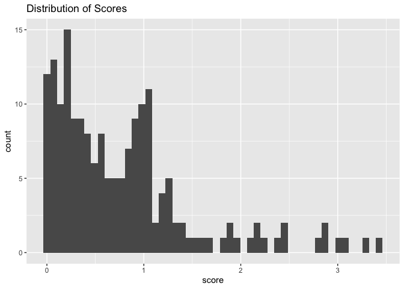

Silvopastoral_Survey
================
Chloe Cho
2023-03-13

Replace “si” or “no” answers with corresponding score value.

- Regeneration = 1 h1_1\_3  

- Planting trees = 2 h1_1\_4

- Live fences = 2 h1_1\_5

- Silvopastoral = 3 h1_1\_6

- Forage banks = 3 h1_1\_7

- No = 0 for all of the questions

# Read Data

This is an initial subset of the survey data and only includes the
answers to Module H, which asks about specific silvopastoral practices
being implemented on the farm.

``` r
module_h <- read.delim("Data/module_h_responses.csv", sep = ",")

module_h <- module_h %>% 
  clean_names() %>%
  replace(is.na(.), 0)

head(module_h)
```

    ##   a2 a1 farm_id area_of_the_farm h1_1_1        h1_2_1 h1_3_1 h1_1_2
    ## 1 A4 10   A4-10            22.95     Si Más de 5 años      6     Si
    ## 2 A4 13   A4-13            54.50     No                    0     Si
    ## 3 A4 14   A4-14            44.00     Si Más de 5 años     10     Si
    ## 4 A4 15   A4-15            38.00     No                    0     Si
    ## 5 A4 16   A4-16            31.40     No                    0     Si
    ## 6 A4  8    A4-8            23.00     No                    0     No
    ##          h1_2_2 h1_3_2 h1_1_3        h1_2_3 h1_3_3 h1_1_4 h1_2_4 h1_3_4 h1_1_5
    ## 1 Más de 5 años     22     Si Más de 5 años    6.0     No             0     No
    ## 2 Más de 5 años     41     Si Más de 5 años   21.0     No             0     No
    ## 3 Más de 5 años     15     Si Más de 5 años   12.0     No             0     No
    ## 4 Más de 5 años     33     Si Más de 5 años    7.5     No             0     No
    ## 5 Más de 5 años     29     Si Más de 5 años   10.0     No             0     No
    ## 6                    0     Si Más de 5 años    7.5     No             0     No
    ##   h1_2_5 h1_3_5 h1_1_6 h1_2_6 h1_3_6 h1_1_7        h1_2_7 h1_3_7
    ## 1             0     No             0     Si Más de 5 años      1
    ## 2             0     No             0     No                    0
    ## 3             0     No             0     No                    0
    ## 4             0     No             0     No                    0
    ## 5             0     No             0     No                    0
    ## 6             0     No             0     No                    0

# Generate Score

Create column for proportion of land cover by the practice for each of
the relevant questions.

``` r
module_h <- module_h %>% 
  mutate(h1_1_3_prop = h1_3_3 / area_of_the_farm, .after = h1_3_3) %>% 
  mutate(h1_1_4_prop = h1_3_4 / area_of_the_farm, .after = h1_3_4) %>%
  mutate(h1_1_5_prop = h1_3_5 / area_of_the_farm, .after = h1_3_5) %>%
  mutate(h1_1_6_prop = h1_3_6 / area_of_the_farm, .after = h1_3_6) %>%
  mutate(h1_1_7_prop = h1_3_7 / area_of_the_farm, .after = h1_3_7)
```

Modify “si” and “no” answers into equivalent numerical scores.

``` r
# Practices worth 1 point. 

module_h <- module_h %>% 
  mutate(h1_1_3_score = case_when(h1_1_3 == 'Si' ~ 1,
  h1_1_3 == 'No' ~ 0), .after = h1_1_3)
  
# Practices worth 2 points. 

module_h <- module_h %>% 
  mutate(h1_1_4_score = case_when(h1_1_4 == 'Si' ~ 2,
  h1_1_4 == 'No' ~ 0), .after = h1_1_4)

module_h <- module_h %>% 
  mutate(h1_1_5_score = case_when(h1_1_5 == 'Si' ~ 2,
  h1_1_5 == 'No' ~ 0), .after = h1_1_5)

# Practices worth 3 points. 

module_h <- module_h %>% 
  mutate(h1_1_6_score = case_when(h1_1_6 == 'Si' ~ 3,
  h1_1_6 == 'No' ~ 0), .after = h1_1_6)

module_h <- module_h %>% 
  mutate(h1_1_7_score = case_when(h1_1_7 == 'Si' ~ 3,
  h1_1_7 == 'No' ~ 0), .after = h1_1_7)
```

Generate cumulative score by summing value of each question weighted by
proportion of land cover under that practice.

``` r
module_h <- module_h %>% 
  mutate(score = h1_1_3_score * h1_1_3_prop +
           h1_1_4_score * h1_1_4_prop +
           h1_1_5_score * h1_1_5_prop +
           h1_1_6_score * h1_1_6_prop +
           h1_1_7_score * h1_1_7_prop) %>%
  mutate(score = replace(score, score < 0, NA))

head(module_h)
```

    ##   a2 a1 farm_id area_of_the_farm h1_1_1        h1_2_1 h1_3_1 h1_1_2
    ## 1 A4 10   A4-10            22.95     Si Más de 5 años      6     Si
    ## 2 A4 13   A4-13            54.50     No                    0     Si
    ## 3 A4 14   A4-14            44.00     Si Más de 5 años     10     Si
    ## 4 A4 15   A4-15            38.00     No                    0     Si
    ## 5 A4 16   A4-16            31.40     No                    0     Si
    ## 6 A4  8    A4-8            23.00     No                    0     No
    ##          h1_2_2 h1_3_2 h1_1_3 h1_1_3_score        h1_2_3 h1_3_3 h1_1_3_prop
    ## 1 Más de 5 años     22     Si            1 Más de 5 años    6.0   0.2614379
    ## 2 Más de 5 años     41     Si            1 Más de 5 años   21.0   0.3853211
    ## 3 Más de 5 años     15     Si            1 Más de 5 años   12.0   0.2727273
    ## 4 Más de 5 años     33     Si            1 Más de 5 años    7.5   0.1973684
    ## 5 Más de 5 años     29     Si            1 Más de 5 años   10.0   0.3184713
    ## 6                    0     Si            1 Más de 5 años    7.5   0.3260870
    ##   h1_1_4 h1_1_4_score h1_2_4 h1_3_4 h1_1_4_prop h1_1_5 h1_1_5_score h1_2_5
    ## 1     No            0             0           0     No            0       
    ## 2     No            0             0           0     No            0       
    ## 3     No            0             0           0     No            0       
    ## 4     No            0             0           0     No            0       
    ## 5     No            0             0           0     No            0       
    ## 6     No            0             0           0     No            0       
    ##   h1_3_5 h1_1_5_prop h1_1_6 h1_1_6_score h1_2_6 h1_3_6 h1_1_6_prop h1_1_7
    ## 1      0           0     No            0             0           0     Si
    ## 2      0           0     No            0             0           0     No
    ## 3      0           0     No            0             0           0     No
    ## 4      0           0     No            0             0           0     No
    ## 5      0           0     No            0             0           0     No
    ## 6      0           0     No            0             0           0     No
    ##   h1_1_7_score        h1_2_7 h1_3_7 h1_1_7_prop     score
    ## 1            3 Más de 5 años      1  0.04357298 0.3921569
    ## 2            0                    0  0.00000000 0.3853211
    ## 3            0                    0  0.00000000 0.2727273
    ## 4            0                    0  0.00000000 0.1973684
    ## 5            0                    0  0.00000000 0.3184713
    ## 6            0                    0  0.00000000 0.3260870

# Basic Descriptive Statistics

Check distribution of scores.

``` r
module_h %>% ggplot(aes(x = score)) +
  geom_histogram(bins = 50) + 
  ggtitle('Distribution of Scores')
```

    ## Warning: Removed 3 rows containing non-finite values (`stat_bin()`).

<!-- -->

Range = \[0.000000, 3.428571\]

``` r
range_score = range(na.omit(module_h$score))
range_score
```

    ## [1] 0.000000 3.428571

Average score = 0.7675455

``` r
mean_score = mean(na.omit(module_h$score))
mean_score
```

    ## [1] 0.7675455

Median score = 0.5930233

``` r
median_score = median(na.omit(module_h$score))
median_score
```

    ## [1] 0.5930233

Max score = 3.428571

``` r
max_score = max(na.omit(module_h$score))
max_score
```

    ## [1] 3.428571

Min score = 0

``` r
min_score = min(na.omit(module_h$score))
min_score
```

    ## [1] 0
